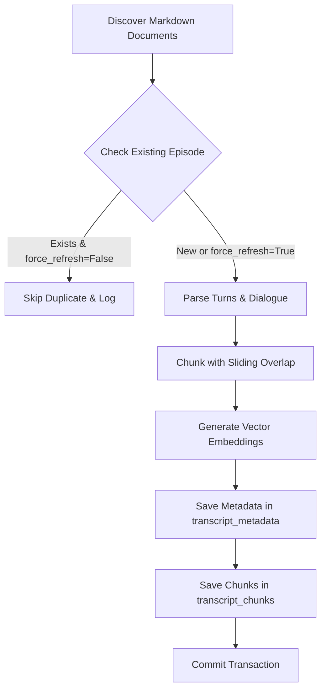

# Lenny's Podcast Knowledge Base & RAG Architecture

This document describes the knowledge base, ingestion pipeline, chunking strategy, vector embeddings, pgvector retrieval, citation generation, and refresh procedures implemented in **Phase 3** of *The Lenny Growth Assistant*.

---

## 1. Data Sources & Format

Transcripts are sourced from curated archives of **Lenny's Podcast**:
- **Local Sample Archive**: Located in `backend/data/transcripts/` containing full markdown transcripts with structured YAML frontmatter (Casey Winters, Elena Verna, Brian Balfour, Shreyas Doshi).
- **Public Community Repositories**: Supports direct ingestion from `LennysNewsletter/lennys-newsletterpodcastdata` and `ChatPRD/lennys-podcast-transcripts`.

### Source Record Schema
Each transcript contains YAML frontmatter and dialogue turns:
```yaml
---
episode_number: 42
title: "Casey Winters on Growth Loops, Retention, and Why Blended Metrics Lie"
guest: "Casey Winters"
guest_role: "Former CPO at Eventbrite, Growth Lead at Pinterest"
published_date: "2023-04-14"
transcript_url: "https://www.lennyspodcast.com/casey-winters"
audio_url: "https://www.youtube.com/watch?v=WlRfyEpAKxw"
duration_seconds: 4800
summary: "Detailed overview..."
---

**Lenny Rachitsky** (00:00:05):
Welcome to Lenny's Podcast...

**Casey Winters** (00:00:44):
Product-market fit is revealed when a cohort retention curve stops dropping...
```

Stored in PostgreSQL table `transcript_metadata` with primary key `id` (`ep-{uuid}`), indexed by `episode_number` and `guest`.

---

## 2. Ingestion Pipeline & Idempotency

The ingestion pipeline is implemented in [`IngestionService`](file:///d:/oogway/backend/app/services/ingestion_service.py).

### Workflow


### Idempotency
- Before writing, `_find_existing_episode` checks by `episode_title` or `transcript_url`.
- If an episode exists and `force_refresh=False`:
  - Logs `[INGESTION] Skipped duplicate episode: ...`
  - Increments `episodes_skipped` counter.
  - Generates zero duplicate chunks or database rows.
- If `force_refresh=True`:
  - Deletes prior chunks for that episode and atomically re-indexes.

### Structured Logging
Logs capture:
- Discovered source document count
- Processing per episode
- Skipped duplicates
- Failed files with tracebacks
- Total chunks created and pipeline duration in seconds

---

## 3. Dialogue-Aware Chunking

Implemented in [`ChunkingService`](file:///d:/oogway/backend/app/services/chunking_service.py).

Podcast transcripts are dialogues, not essays. Arbitrary character or token chunking splits mid-sentence and discards who is speaking.

### How Chunking Works
1. **Turn Parsing**: Regular expressions identify speaker labels and timestamps: `**Speaker** (MM:SS): text`.
2. **Context Windowing**: Consecutive turns are combined until `CHUNK_SIZE` (default 800 characters) is reached.
3. **Context Overlap**: Rather than hard token truncation, tail turns up to `CHUNK_OVERLAP` (default 150 characters) are carried over into the next chunk, ensuring continuous conversational context.
4. **Timestamp Preservation**: The earliest timestamp within each chunk is extracted and stored on the `transcript_chunks` record.
5. **Speaker Attribution**: The chunk content retains speaker labels (`**Casey Winters** (15:20): ...`), so the LLM knows exactly who made each statement.

---

## 4. Embeddings & pgvector

Implemented in [`EmbeddingService`](file:///d:/oogway/backend/app/services/embedding_service.py) and [`TranscriptChunkModel`](file:///d:/oogway/backend/app/models/transcript.py).

### Database Schema
Table: `transcript_chunks`
- `id`: `String(64)` primary key (`chk-{uuid}`)
- `transcript_id`: `String(64)` foreign key to `transcript_metadata.id` with `ON DELETE CASCADE`
- `episode_number`: `Integer`
- `episode_title`: `String(255)`
- `guest`: `String(128)`
- `guest_role`: `String(255)`
- `source_url`: `String(512)`
- `chunk_index`: `Integer`
- `timestamp`: `String(32)`
- `content`: `Text`
- `token_count`: `Integer`
- `embedding`: `Vector(1536)`

### Indexing
In PostgreSQL with `pgvector`:
```sql
CREATE EXTENSION IF NOT EXISTS vector;
CREATE INDEX IF NOT EXISTS ix_transcript_chunks_embedding 
ON transcript_chunks USING hnsw (embedding vector_cosine_ops);
```

### Provider Configuration
Configurable via environment variables without hardcoding keys:
- `EMBEDDING_PROVIDER`: `"auto"` | `"openai"` | `"ollama"` | `"mock"`
- `OPENAI_API_KEY`: API key for OpenAI
- `EMBEDDING_MODEL`: `"text-embedding-3-small"` (default)
- `EMBEDDING_DIMENSIONS`: `1536`

**Fallback & Offline Resilience**:
When `EMBEDDING_PROVIDER=auto` and no cloud key is set (or during local tests), a deterministic n-gram hashing vector generator projects text into a unit-norm 1536-dimensional vector. This allows local evaluation and testing without external cloud network dependencies.

---

## 5. Semantic Vector Retrieval

Implemented in [`RetrievalService`](file:///d:/oogway/backend/app/services/retrieval_service.py).

### Retrieval Flow
1. Query normalization and validation.
2. Embedding generation for query string via `EmbeddingService.embed_query`.
3. Database similarity search:
   - **PostgreSQL**: Executes native pgvector cosine distance:
     ```sql
     SELECT id, content, embedding <=> :query_vector AS distance
     FROM transcript_chunks
     ORDER BY distance ASC
     LIMIT :top_k;
     ```
     Similarity score is calculated as `1.0 - distance`.
   - **SQLite Fallback**: In-memory cosine similarity computation over stored vectors.
4. Threshold Filtering: Results below `SIMILARITY_THRESHOLD` (default 0.10) are filtered out.
5. Top $K$ results returned with source metadata.

---

## 6. Citation Generation & Source Traceability

Every retrieved chunk maps directly to the existing `CitationSchema`:
```json
{
  "id": "chk-5eb5fb191fd3",
  "episodeNumber": 42,
  "episodeTitle": "Casey Winters on Growth Loops, Retention, and Why Blended Metrics Lie",
  "guest": "Casey Winters",
  "guestRole": "Former CPO at Eventbrite, Growth Lead at Pinterest",
  "timestamp": "00:00:44",
  "quoteExcerpt": "**Casey Winters** (00:00:44): Product-market fit is revealed when a cohort retention curve stops dropping and runs completely flat parallel to the horizontal axis...",
  "episodeUrl": "https://www.lennyspodcast.com/casey-winters",
  "relevanceScore": 0.2653
}
```

### Zero Citation Fabrication Guarantee
If retrieval returns zero results above the threshold:
- Assistant message status is set to `"low-evidence"`.
- Zero citations are attached (`citations: []`).
- The assistant clearly explains that Lenny's podcast archives do not contain sufficient evidence on this topic.

---

## 7. Knowledge Base Operations & Refresh

### Command Line Interface (CLI)
Ingest local sample transcripts:
```bash
python run_ingest.py --sample
```

Force refresh (re-chunk and re-embed existing episodes):
```bash
python run_ingest.py --sample --force
```

Ingest from GitHub repository:
```bash
python run_ingest.py --github --limit 10
```

Inspect knowledge base statistics:
```bash
python run_ingest.py --stats
```

### REST API Endpoints
- `POST /api/knowledge/ingest`: Trigger ingestion via JSON payload.
  ```json
  {
    "source": "sample",
    "limit": 5,
    "forceRefresh": false
  }
  ```
- `GET /api/knowledge/stats`: Retrieve total episode and chunk counts, database dialect, and top guests.
- `POST /api/knowledge/search`: Test semantic retrieval directly.
  ```json
  {
    "query": "How do growth loops compound?",
    "topK": 3
  }
  ```

---

## 8. Pi Coding Agent & Multi-Provider Architecture (Phase 4)

Phase 4 introduces an autonomous agent layer powered by the **Pi Coding Agent Framework** and a multi-provider execution model:

### Multi-Provider Architecture (`backend/app/agent/providers.py`)
- **Cloud OpenAI (`OpenAIProvider`)**:
  - Model: `OPENAI_MODEL` (default: `gpt-4o-mini`).
  - Handles chat completions with tool calling schemas.
  - If `OPENAI_API_KEY` is not configured, returns structured error (`MissingProviderKeyError` / `PROVIDER_OPENAI_KEY_MISSING`) without crashing.
- **Local Ollama (`OllamaProvider`)**:
  - Endpoint: `OLLAMA_BASE_URL` (default: `http://localhost:11434`), `OLLAMA_MODEL` (default: `llama3.2:3b`).
  - High-performance local inference with TCP availability checking.
  - Returns structured error (`ProviderUnavailableError` / `PROVIDER_OLLAMA_OFFLINE`) when unreachable.
- **Mock Provider (`MockAgentProvider`)**:
  - Deterministic ReAct tool-calling mock for sub-second automated testing and offline verification.
- **Configurable Fallback (`ProviderManager`)**:
  - Governed by `MODEL_FALLBACK_ENABLED=false` (default disabled to prevent silent provider masking).
  - When enabled, automatically falls back (e.g. Ollama offline -> OpenAI Cloud, or OpenAI missing key -> Local Ollama) with explicit metadata (`requested_provider`, `actual_provider`, `fallback_reason`).

### Agent Core & Tool Registry (`backend/app/agent/`)
- **`AgentService`**: Orchestrates the ReAct execution loop, coordinating prompt assembly, provider communication, tool dispatch, zero-citation validation, and low-evidence detection.
- **`ToolRegistry`**: Manages verified agent tools:
  - `search_lenny_transcripts(query: str, top_k: int = 3)`: Autonomous semantic search over chunk embeddings.
  - `lookup_episode_source(episode_title_or_guest: str)`: Real-time metadata inspection (audio URLs, publication dates, guest roles).
- **Strict Grounding & Zero Citation Fabrication**:
  - Citations are strictly extracted from verified chunks returned by tool calls (`search_lenny_transcripts`).
  - If no chunks pass similarity threshold or the query is outside Lenny's podcast scope (e.g. crypto/Solana staking), the agent transitions to `status="low-evidence"` with zero citations and an explicit explanation.
- **Multi-Turn History Preservation**:
  - Prior conversation turns are forwarded to the agent runner to maintain context during follow-up questions.
